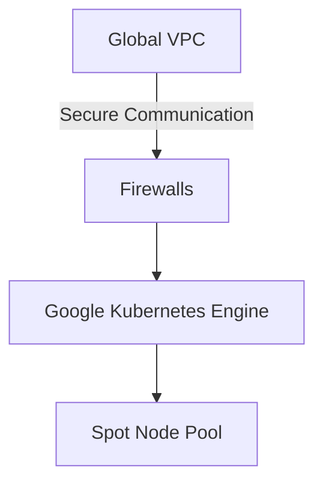
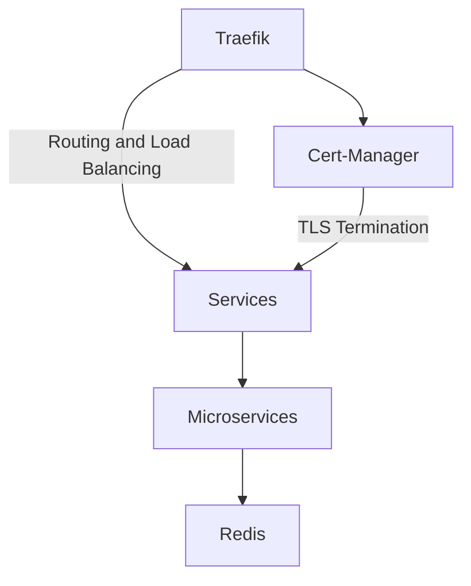
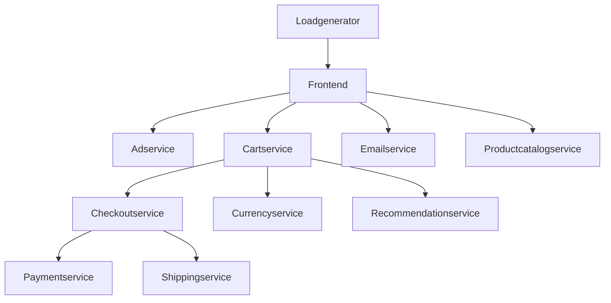

# GCP Microservice Infrastructure

This repository contains the infrastructure code for deploying microservices on Google Cloud Platform (GCP).

## Table of Contents
- [Introduction](#introduction)
- [Architecture](#architecture)
- [Prerequisites](#prerequisites)
- [Usage](#usage)
- [Contributing](#contributing)
- [License](#license)

## Introduction
This repository provides a set of Terraform configurations, Kubernetes components, and microservice setups to deploy a scalable and robust microservice architecture on GCP.

## Architecture

### GCP Infrastructure

### Kubernetes Components

### Microservices

The application consists of the following microservices:
- **adservice**
- **cart**
- **cartservice**
- **checkoutservice**
- **currencyservice**
- **emailservice**
- **frontend**
- **loadgenerator**
- **paymentservice**
- **productcatalogservice**
- **recommendationservice**
- **shippingservice**

These microservices are deployed using an application Helm chart to ensure streamlined deployment and management.

## Prerequisites
- A Google Cloud account.
- `gcloud` CLI installed and authenticated.
- Terraform installed (version 1.x or later recommended).
- `kubectl` installed and configured.

## Contributing
Contributions are welcome! Please follow these steps:
- Fork the repository.
- Create a feature branch.
- Commit your changes.
- Open a pull request.

## License
This project is licensed under the MIT License. See the [LICENSE](LICENSE) file for details.

